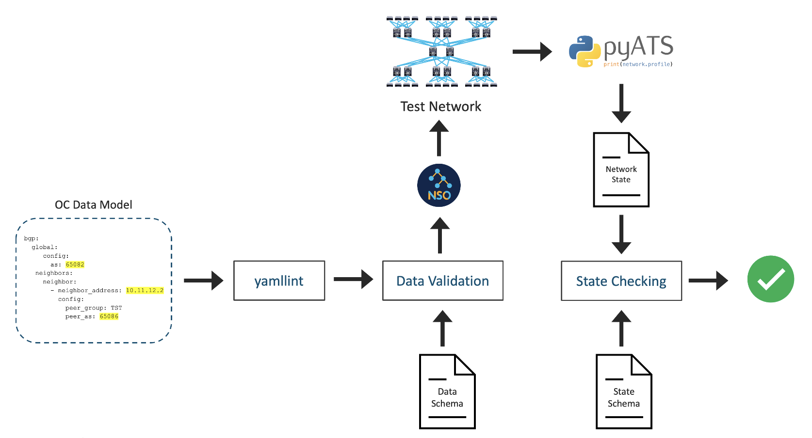
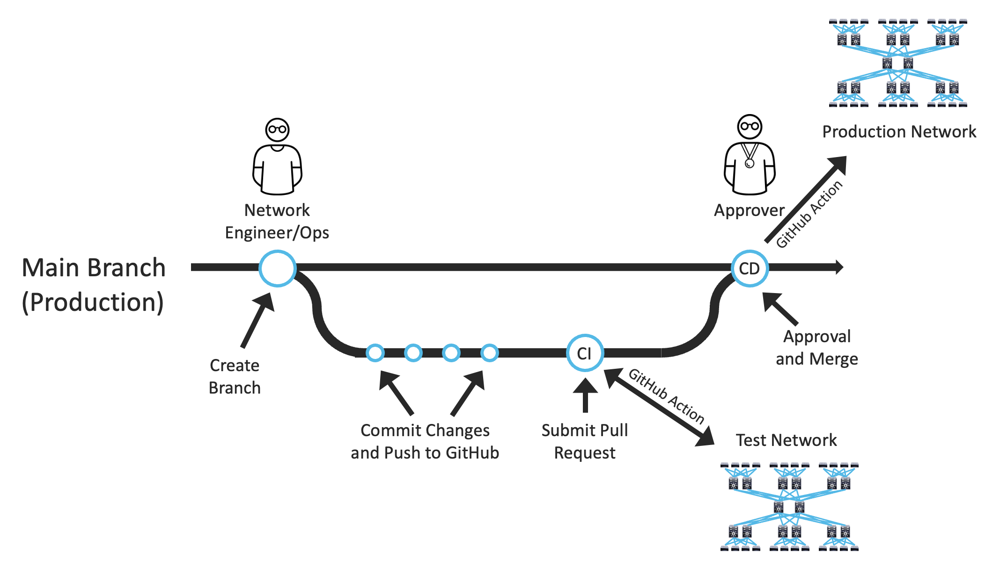
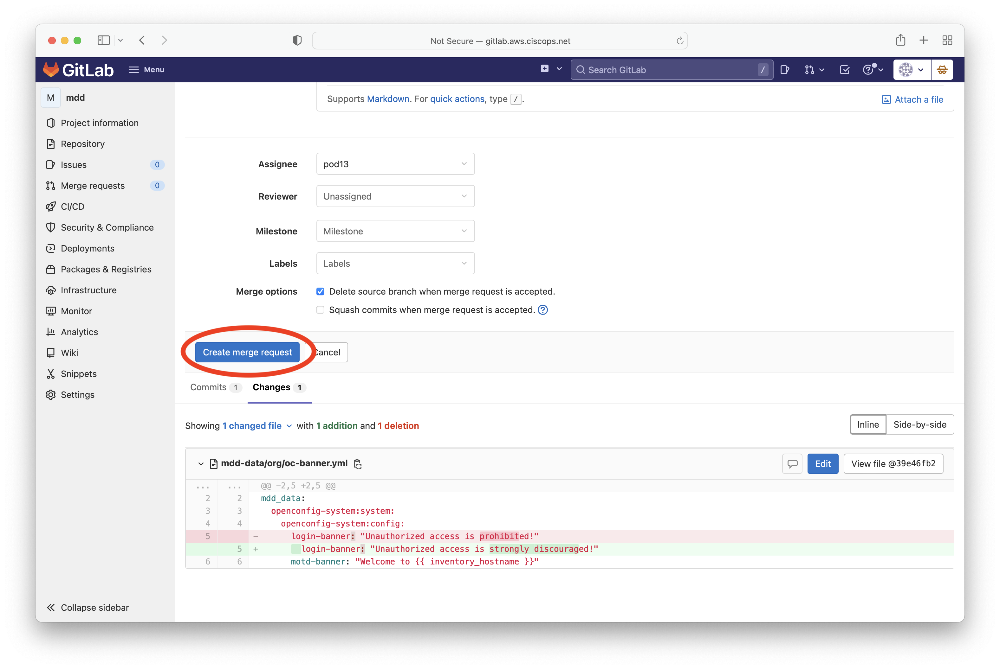
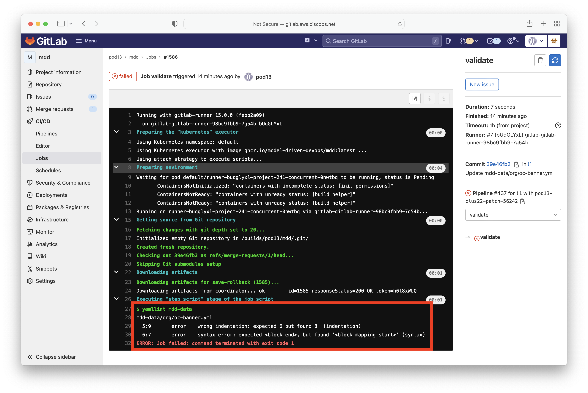
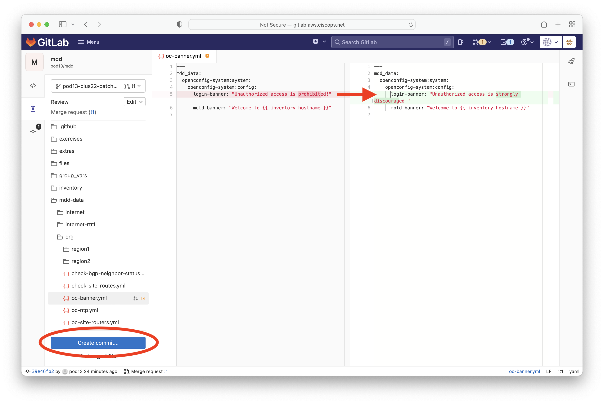
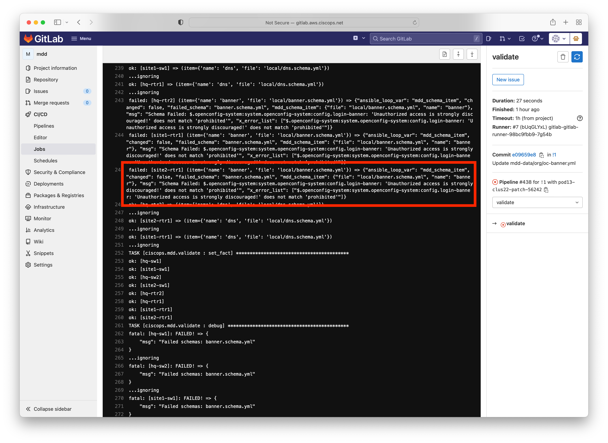
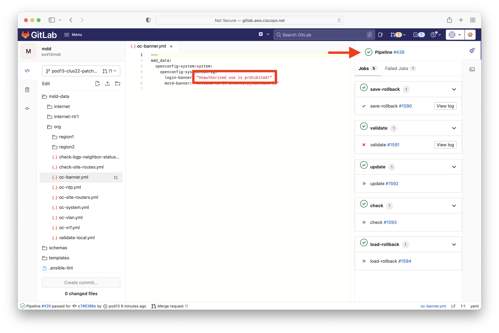
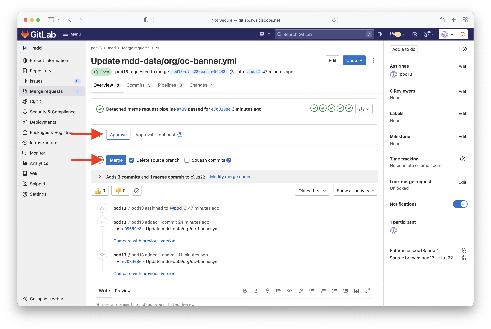
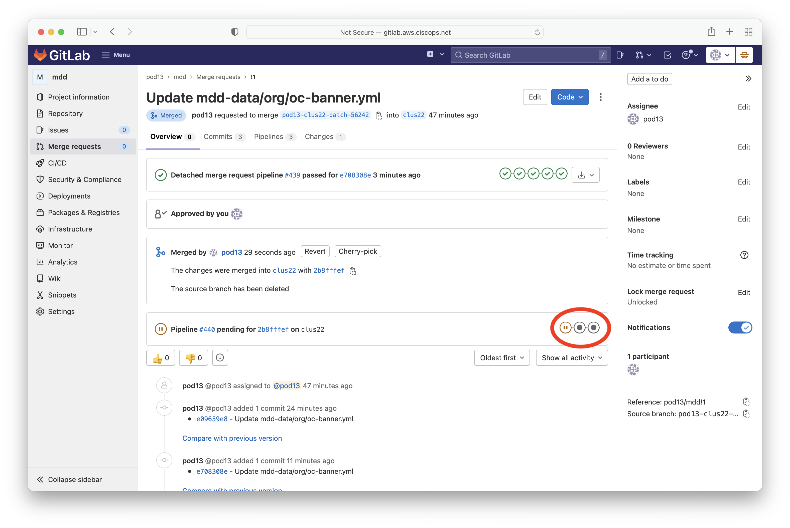

# CI/CD
Automation can help you make changes faster and at scale, but with all that power comes great risk, particlarly when applied to physical network infrastructure.  All other IT services depend on the physical network.  Used indiscriminately, automation can crater your network faster than you ever thought possible.  This is one of the many reasons that network engineers have been slow to adopt automation in the physical network compared to their peers in application development who might just crater their own application.  

As you have seen in the preceeding exercises, infrastructure-as-code and choosing the right data models can help put some much needed rigor around data validation and network state checking.  But it is not until we place our infrastructure-as-code into version control and automate the validation and testing that we start to see the real benefits of adopting infastructure as code and DevOps.

Continuous Integration (CI) is the concept of continuously testing and validating changes, while Continuous Deployment (CD) is the process and automation around moving validated changes into production.  Together, CI/CD provides the needed rigor to *safely* and *rapidly* inject change into production.  These tools and processes were developed, and mostly used in, the cloud and application space, but they are equally applicable to the network *if* you have adopted the tools and concepts covered in the previous exercises.

## GitLab

In this lab you will use GitLab to provide version control, workflow enforcement and CI/CD automation.  GitLab conveniently combines all of these features into a single web UI, which makes it ideal for lab environments like this.  You will create a project named `mdd` and push the MDD repo to this project.

1. To access Gitlab, open http://devtools-gitlab.lab.devnetsandbox.local in your browser.  Login with the "developer" credentials.

2. Set an API key by clicking on your user icon in the upper right corner, selecting Preferences, then Access Tokens and create a token with the "api" scope selected.  Name the token "api-token" and click "Create personal access token".  **Copy the token after it is created.**

3. In Visual Studio Code, set your GITLAB_API_TOKEN in your environment.  Update `your_token_value` in the following command to the value of your token.
    ```
    export GITLAB_API_TOKEN=your_token_value
    ```

4. Create the GitLab project.  If you are curious about how to create projects and CI variables in GitLab using the API, open up the file `extras/create-gitlab-project.sh` and examine the CURL commands used.
    ```
    extras/create-gitlab-project.sh
    ```

> Note: all further instructions in this exercise assume you are in the GitLab UI unless otherwise stated.

## Continuous Integration

Throughout this workshop we have been building a complete CI process that includes linting, data validation and state checking as shown in the diagram below. It is now time to take the next step and use these tools to build out an automated CI pipeline.



5. Navigate to **Repository -> Files** and click on the `gitlab-ci.yml` file to view its contents.

The `.gitlab-ci.yml` file contains instructions that GitLab will use to run the CI (and/or CD) pipeline for this project.  Your file should looks similar to the one shown below:

```
stages:
  - clean
  - build-cml
  - build-nso
  - init-nso
  - save-rollback
  - validate
  - update
  - check
  - load-rollback

image: ghcr.io/model-driven-devops/mdd:1.2.5rc2

variables:
  ANSIBLE_CONFIG: "./ansible.cfg"
  CML_VERIFY_CERT: "false"
  NSO_INSTALL: "true"

clean:
  stage: clean
  script:
    - ansible-playbook cisco.cml.clean
  resource_group: mdd
  rules:
    - if: $CLEAN == "true"

build-cml:
  stage: build-cml
  script:
    - ansible-playbook cisco.cml.build -e wait='yes'
  resource_group: mdd
  rules:
    - if: $CLEAN == "true"

build-nso:
  stage: build-nso
  script:
    - ansible-playbook ciscops.mdd.nso_install
    - ansible-playbook ciscops.mdd.nso_update_packages
    - ansible-playbook ciscops.mdd.nso_init
    - ansible-playbook ciscops.mdd.nso_update_devices
  resource_group: mdd
  rules:
    - if: $CLEAN == "true" && $NSO_INSTALL == "true"

init-nso:
  stage: init-nso
  script:
    - ansible-playbook ciscops.mdd.nso_init
    - ansible-playbook ciscops.mdd.nso_delete_devices
    - ansible-playbook ciscops.mdd.nso_update_devices
    - ansible-playbook ciscops.mdd.update -e dry_run=no
  resource_group: mdd
  rules:
    - if: $NSO_INIT == "true"

save-rollback:
  stage: save-rollback
  script:
    - ansible-playbook ciscops.mdd.nso_save_rollback
  resource_group: mdd
  artifacts:
    paths:
      - rollback.yaml
    expire_in: 1 hour
  rules:
    - if: $CI_PIPELINE_SOURCE == "merge_request_event"

validate:
  stage: validate
  script:
    - yamllint mdd-data
    - ansible-playbook ciscops.mdd.validate
  resource_group: mdd
  rules:
    - if: $CI_PIPELINE_SOURCE == "web"
    - if: $CI_PIPELINE_SOURCE == "merge_request_event"
    - if: $CI_PIPELINE_SOURCE == "push" && $CI_COMMIT_BRANCH == "main"
    - if: $CI_PIPELINE_SOURCE == "api"

update:
  stage: update
  script:
    # update devices in case DHCP address changed
    # - ansible-playbook ciscops.mdd.nso_update_devices
    - ansible-playbook ciscops.mdd.update -e dry_run=no
  resource_group: mdd
  rules:
    - if: $CI_PIPELINE_SOURCE == "web"
    - if: $CI_PIPELINE_SOURCE == "merge_request_event"
    - if: $CI_PIPELINE_SOURCE == "push" && $CI_COMMIT_BRANCH == "main"
    - if: $CI_PIPELINE_SOURCE == "api"

check:
  stage: check
  script:
    # allow network to converge before running checks
    - sleep 60
    - ansible-playbook ciscops.mdd.check
  resource_group: mdd
  rules:
    - if: $CI_PIPELINE_SOURCE == "web"
    - if: $CI_PIPELINE_SOURCE == "merge_request_event"
    - if: $CI_PIPELINE_SOURCE == "push" && $CI_COMMIT_BRANCH == "main"
    - if: $CI_PIPELINE_SOURCE == "api"

load-rollback:
  stage: load-rollback
  script:
    # update devices in case DHCP address changed
    # - ansible-playbook ciscops.mdd.nso_update_devices
    - ansible-playbook ciscops.mdd.nso_load_rollback
  resource_group: mdd
  rules:
    - if: $CI_PIPELINE_SOURCE == "merge_request_event"
      when: always
```

Some things to note from this pipeline configuration:
- `stages` defines the stages to run in this pipeline and in what order
- Each stage can have one or more jobs associated with it
- This particular pipeline uses a 1:1 mapping between stages and jobs
- Which jobs get executed in a particular pipeline run are controlled by various rules
- The commands used in the `script` section of each stage should look familiar to you from the previous exercises

This file is essentially an ordered list of commands to run.  At each stage, if there is a failure, the entire pipeline will fail at that point.  This is useful for CI/CD because we want to fail early if there are basic errors found in linting, for instance, because each progressive stage is a little more time and resource intensive.  This methodology is known as "fail fast".

The pipeline supports three basic scenarios that we will leverage later in this exercise:
- The pipeline was run via either `web` or `api`, in which case you can set `CLEAN` to "true" in order to have the pipeline rebuild the entire topology in CML
- The pipeline was run via `merge_request_event`, this will be the CI pipeline (more on this below)
- The pipeline was run via `push` to branch `main`, this will be the CD pipeline (more on this below)

## Workflow

Because our infrastructure is represented as code, we get to take advantage of all the nice features that GitLab has for managing code.  And we get it, basically, for free.  In this lab we will use a common workflow in DevOps, illustrated below:



This workflow involves:
- Creating a branch of the main (or production) branch
- Making changes in your branch
- Creating a merge request from your branch into the main branch (or pull request in GitHub vocabulary)
- Automatically running CI
- Requring approval of the merge request
- Automatically running CD after approval 

To exercise this workflow, lets try again to change the banner, but this time use the GitLab Web IDE to do it. 

6. Navigate to **Repository -> Files** and click on the `Web IDE` in the upper right hand corner.


7. In the file browser, navigate to `mdd-data/org/oc-banner.yml` and open the file.

8. Change the value of `login-banner` to "Unauthorized access is strongy discouraged!" and shift the line to the right two spaces.

9. Click `Commit...` in the lower left hand corner.


10. Leave the options `Create a new branch` and `Start a new merge request` selected, then click `Commit`.  Optionally, you can add a commit message, or just leave the default.

11. At the bottom of the page, click `Changes`, verify the changes you made and then click `Create merge request`.



Watch the pipeline at this point and view the various stages of the pipeline as they execute.  This pipepine is the CI pipeline. Note the stages it has:
- save-rollback
- validate
- update
- check
- load-rollback


In CI we don't necessarily want to push these changes to production.  Perhaps the merge request will not be approved.  Or, perhaps it will require more changes before passing the pipeline. Either way, we do not want to leave the changes in the test network when we are done, therefore we save the rollback ID before continuing on with the CI pipeline.  After the pipeline completes, we load the rollback ID to reverse any changes we made.  This way the test network is left in the state it was in prior to any changes we made in CI.  This model works well in the case that we have a physical (or hybrid virtual/physical) test network, where it might be difficult or time consuming to return the physical devices to a known state.

In this case, your change should have failed at the `validate` stage.

12. Click on the validate stage to see the output of this stage and verify that it failed the yamllint check because the indentation was not correct.



You should see this in the output:

```
$ yamllint mdd-data
28mdd-data/org/oc-banner.yml
29  5:9       error    wrong indentation: expected 6 but found 8  (indentation)
30  6:7       error    syntax error: expected <block end>, but found '<block mapping start>' (syntax)
32ERROR: Job failed: command terminated with exit code 1
```

Let's fix this error.

13. Click the back button in the browser to go back to your merge request.

14. In the upper right corner of the page, click `Open in WebIDE`.


15. Fix the indentation issue and click `Commit...` and then `Commit`.



16. In the upper right corner of the page, click the rocket ship icon to view the pipeline run.

17. When it fails, click on the job ID next to the validate stage and verify the reason for the failure.



You should see this in the output:

```
fatal: [site1-rtr1]: FAILED! => {"changed": false, "failed_schema": "Network banner schema", "msg": "Schema Failed: $.openconfig-system:system.openconfig-system:config.openconfig-system:login-banner: 'Unauthorized access is strongly encouraged!' does not match 'prohibited'", "x_error_list": ["$.openconfig-system:system.openconfig-system:config.openconfig-system:login-banner: 'Unauthorized access is strongly encouraged!' does not match 'prohibited'"]}
```

Let's fix this error.

18. Close the tab with the job output, and modify the banner to be compliant.  Change "Unauthorized access is strongly discouraged!" to "Unauthorized use is prohibited!".

19. Click `Commit...` and then `Commit`.

20. Click the rocket ship icon to view the pipeline run. It should complete successfully this time.  If not, view the pipeline output and fix any errors.



21. After the pipeline completes successfully, navigate back to your merge request.

You should now see that the CI pipeline completeed successfully and your merge request is now ready for approval. In this lab we do not have the rules set such that the merge request *requires* approval, but putting another human in the loop might be something you would want to do depending on your environment.

Remember also that, at this point, the CI pipeline has backed out the changes made to the test network during testing. In order to move our change into production, we need to merge our change into the production branch ("main" in this case). Let's approve the merge request ourselves and merge the change into production.

22. Click `Approve` and then `Merge`.



Note the pipe line that is running now in the merge request window. This is the CD pipeline. Because our merge request had a successful pipeline run, and it was approved, we are now deploying to production. Note that we do not save the rollback ID or load a rollback ID at this point. These changes were already validated and checked and are now ready for production.



Wait for the CD pipeline to complete before moving on.

> Note: sometimes you need to refresh your browser window to get the pipeline status to update.

## Verification

Let's validate that the new banner was pushed out to the devices.  In the terminal, find the IP address of `hq-rtr1`:

```bash
ansible-playbook cisco.cml.inventory --limit hq-rtr1
```

Then login to the device using SSH with username admin and password admin (substitute your `hq-rtr1` IP address here):

```
$ ssh admin@10.10.20.135
Unauthorized use is prohibited!
Password:
Welcome to hq-rtr1

hq-rtr1#
```

## Summary

This exercise was a culmination of everything you have learned so far in this lab.  When the rigor of CI/CD is applied to infrastructure as code, great things happen!  Not only does it help us accelerate change into production, it does so in a more secure, more compliant, and unltimately, less risky way. The goal here is to build trust with other IT stakeholders such that you can now automate other business processes on top of your network infrastructure and achieve true business transformation.

Finally, there are a few key takeaways from this lab:
- DevOps tools, processes and principles *can* be applied to network infrastructure!
- Models are the key to all of this. Without a well-defined model, the validation and state checking required will not be possible.
- Operators and engineers working in this model do not need to be progammers. The skill set require of people to effectively operate in this model are understanding data formats (i.e. YAML/JSON) and being able to create/modify schema against that validate the data (i.e. JSON Schema).

[Home](../README.md#workshop-exercises) | [Previous](check-state.md#state-checking) | [Next](exploring-netbox.md#exploring-netbox)
